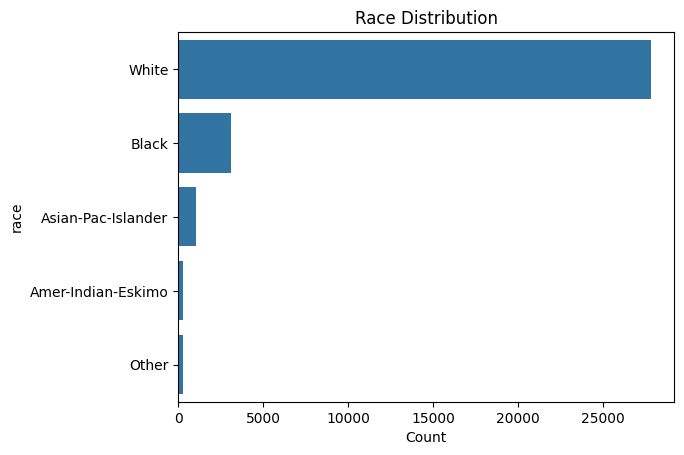
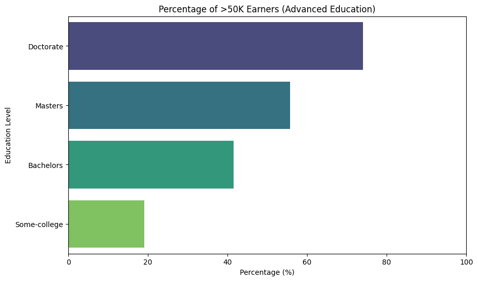
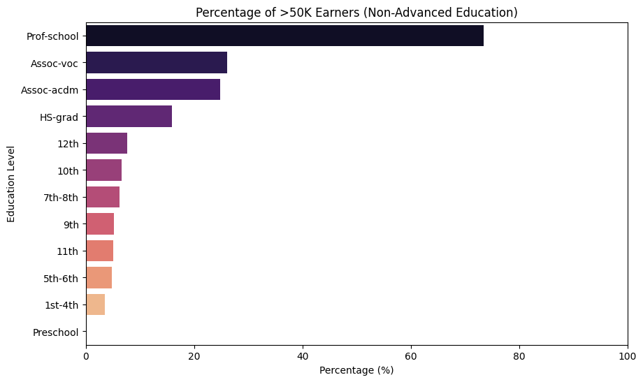
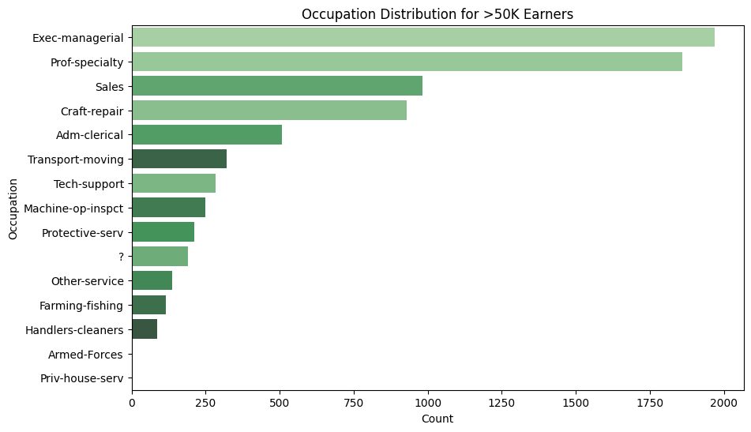

# 📊 Demographic Data Analyzer

This project analyzes the Adult Income dataset from the UCI Machine Learning Repository. It focuses on key demographic factors influencing income levels — particularly whether an individual earns more than $50K per year. The analysis was conducted using Python and presented in a Jupyter Notebook.

---

## 🔍 Project Goals

- Analyze demographic data to uncover patterns related to income distribution.
- Answer specific demographic questions such as:
  - What is the average age of men?
  - Which race has the highest representation?
  - What percentage of individuals with advanced education earn >50K?
  - Which country has the highest percentage of high-income earners?
  - What are the most common occupations for high earners?

---

## 📁 Dataset Information

- Source: [UCI Adult Income Dataset](https://archive.ics.uci.edu/ml/datasets/adult)
- Features include: `age`, `workclass`, `education`, `marital-status`, `occupation`, `race`, `sex`, `capital-gain`, `hours-per-week`, `native-country`, and `salary`.

---

## 📈 Visualizations

### 1. 📚 Race Distribution

Shows distribution of Race

---

### 2. 📚 Education Level vs Income

Shows distribution of income brackets across different education levels.

---

---

### 3. 👔 Popular Occupations for High Earners

Identifies the most common jobs among those who earn more than $50K.

---

## ✅ Key Insights

- **United States** has the highest number and percentage of individuals earning >50K.
- People with **advanced degrees (Bachelors, Masters, Doctorate)** are significantly more likely to earn >50K.
- The most common high-income occupation is **Exec-managerial**.
- People working **minimum hours (1/week)** still earn >50K in rare cases, suggesting multiple income streams or reporting anomalies.

---

## 🛠️ Tools Used

- Python (Pandas, Matplotlib, Seaborn)
- Jupyter Notebook
- GitHub for version control

---
